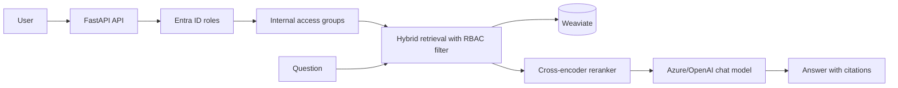

# Enterprise RAG Knowledge Assistant

An enterprise policy assistant that answers questions from an authorized PDF knowledge base. It combines hybrid search, retrieval-time access controls, local cross-encoder reranking, and source citations so that answers remain grounded in documents the user is permitted to access.

## Key Features

- Hybrid (keyword + vector) retrieval with configurable fusion weight
- Local cross-encoder reranking of retrieval candidates
- Retrieval-time document filtering by access group
- Page-level source citations in generated answers
- Deterministic, grounded RAG chain with a safe no-answer response
- FastAPI service with Entra ID role extraction for production use
- Offline retrieval, RBAC, no-answer, generation, and performance evaluations
- Docker image that bundles the reranker model for offline runtime loading

## Architecture



PDF policies are chunked with metadata, embedded, and stored in Weaviate. At query time, the application maps the caller's Entra application roles to internal RAG groups and applies that group filter within the Weaviate query—before candidates are reranked or passed to the LLM.

## Tech Stack

| Area | Technology |
| --- | --- |
| Language and API | Python 3.11+, FastAPI, Uvicorn |
| RAG orchestration | LangChain / LCEL |
| Vector database | Weaviate |
| Models | OpenAI-compatible chat and embedding models; Sentence Transformers cross-encoder |
| Identity | Microsoft Entra ID roles via Azure Container Apps Easy Auth |
| Observability and evaluation | LangSmith tracing and local evaluation scripts |
| Packaging | Docker and Docker Compose |

## How It Works

1. PDFs are loaded from `data/pdfs/` (or `RAG_PDF_DIRECTORY`).
2. The ingestion pipeline extracts text, creates chunks, and assigns document/page/access-group metadata.
3. An embedding is generated for every chunk and stored in Weaviate.
4. A caller sends a question.
5. The API converts Entra app roles into authorized RAG access groups.
6. Weaviate performs hybrid retrieval with an `access_groups` filter.
7. The local cross-encoder reranks the authorized candidates.
8. A fixed prompt asks the LLM to answer only from the retrieved context.
9. The response includes unique document ID, page number, and source-file citations.

## Security & Access Control

In production, Azure Container Apps Easy Auth injects an `X-MS-CLIENT-PRINCIPAL` header. The API decodes its Entra app-role claims and maps them to internal groups such as `All-Employees`, `HR`, `Finance`, `Legal`, and `Security`.

The group filter is part of the Weaviate retrieval query. This matters: unauthorized chunks are excluded before reranking and prompt construction, so they never become LLM context. Local development uses the CLI `--groups` argument; it is explicitly a development-only substitute for identity-based authorization.

Keep API keys and other secrets in environment variables or a managed secret store. Do not commit `.env` files or credentials.

## Evaluation

The repository includes an evaluation dataset and runners for retrieval relevance, RBAC/authorization regressions, no-answer behavior, answer generation quality, citation correctness, and performance checks.

Run the full suite after indexing the corpus:

```bash
python -m evaluation.run_all
```

The retrieval, RBAC, no-answer, and generation evaluations are deployment quality gates; performance is reported as informational. Results, when generated, are written under `evaluation/results/`.

## API

Start the API with `uvicorn rag_chatbot.api:app --host 0.0.0.0 --port 8000`.

| Endpoint | Description |
| --- | --- |
| `GET /` | Service status and documentation link |
| `GET /health` | Health check |
| `POST /chat` | Answers a question using the caller's Entra-authorized groups |
| `GET /docs` | Interactive OpenAPI documentation |

`POST /chat` accepts:

```json
{"question": "How long are security audit logs retained?"}
```

The API expects the Entra identity header in production. For local development, use the CLI below instead of fabricating identity headers.

## Local Setup

### Requirements

- Python 3.11 or newer
- Docker and Docker Compose
- An OpenAI-compatible API key and model access

### Install and configure

```bash
python -m venv .venv
source .venv/bin/activate
pip install -e .
```

Set at least the following in `.env`:

```dotenv
OPENAI_API_KEY=your_key
CHAT_MODEL=gpt-5.6-sol
EMBED_MODEL=text-embedding-3-small
WEAVIATE_HOST=localhost
WEAVIATE_HTTP_PORT=8080
WEAVIATE_GRPC_PORT=50051
```

Start Weaviate and index the included policies:

```bash
docker compose up -d weaviate
python scripts/ingest.py --rebuild
```

Ask a local development question:

```bash
python scripts/chat.py "What is the travel expense policy?" --groups All-Employees
```

Start the HTTP API:

```bash
uvicorn rag_chatbot.api:app --host 0.0.0.0 --port 8000
```

## Docker

Build the application image:

```bash
docker build -t enterprise-rag .
```

The Dockerfile downloads and packages the reranker during image build, then runs it offline at runtime. `docker-compose.yml` currently starts the Weaviate dependency; run the application image separately and provide its environment variables when deploying or testing it in a container.

## Deployment

The intended production path is:

```text
GitHub → GitHub Actions → Azure Container Registry → Azure Container Apps
```

Azure Container Apps can provide Easy Auth for Entra ID, inject the caller principal header, and run the FastAPI container. CI/CD workflow definitions and Azure infrastructure configuration are not yet included in this repository.

## Project Structure

```text
src/rag_chatbot/       API, ingestion, retrieval, reranking, and configuration
scripts/               Ingestion and local development chat commands
evaluation/            Quality and performance evaluators
tests/                 Retrieval and authorization regression tests
data/pdfs/             Sample enterprise-policy source documents
```

## Screenshots / Demo

No UI screenshots are included yet. The FastAPI interactive demo is available locally at `http://localhost:8000/docs` after the service starts.

## Design Decisions

- **Deterministic RAG over agentic RAG:** policy Q&A benefits from a predictable, auditable retrieval-to-answer path.
- **Weaviate:** supports vector storage, hybrid retrieval, and structured filters needed to enforce access groups during retrieval.
- **Hybrid search:** combines semantic similarity with exact terminology and policy identifiers.
- **Reranking:** a cross-encoder improves final context selection after a wider authorized candidate search.
- **Retrieval-time RBAC:** authorization is enforced before LLM prompt construction, reducing data-exposure risk and irrelevant context.

## Limitations & Future Improvements

- Azure infrastructure, Container Apps configuration, and GitHub Actions workflows are not yet committed.
- The Docker Compose file runs Weaviate only; an application service can be added for a complete local container stack.
- API responses are synchronous; streaming responses are not implemented.
- There is no web chat UI or recorded demo yet.
